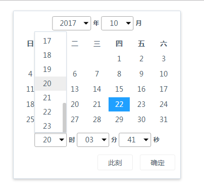

# ngDateTimePicker
一个适用于Angular1.X的dateTimePicker 




Usage
-------------

```
//引入css文件

  <link src='dist/tpl-ngDateTimePicker.css'></link>
....  

//在引入angular.js后引入 tpl-ngDateTimePicker.js

  <script src='dist/tpl-ngDateTimePicker.js'></script>
```
## ngDateTimePicker-popup
```
  angular.module('myApp',['ngDateTimePicker'])
  .controller('myCtrl',function($scope, ngDateTimePicker){
    $scope.show = function(ev){
      ngDateTimePicker.open({
        $scope : $scope,
        ngModel : 'datetime',   //双向数据绑定
        position : ev.target    //显示在某元素的位置下
        format : 'yyyy-MM-dd HH:mm:ss' //绑定元素输出的格式  若无该属性，格式为时间戳
                                       //所支持的格式 见 angular 内置date 过滤器
                                       
      })
    }
  })
```

